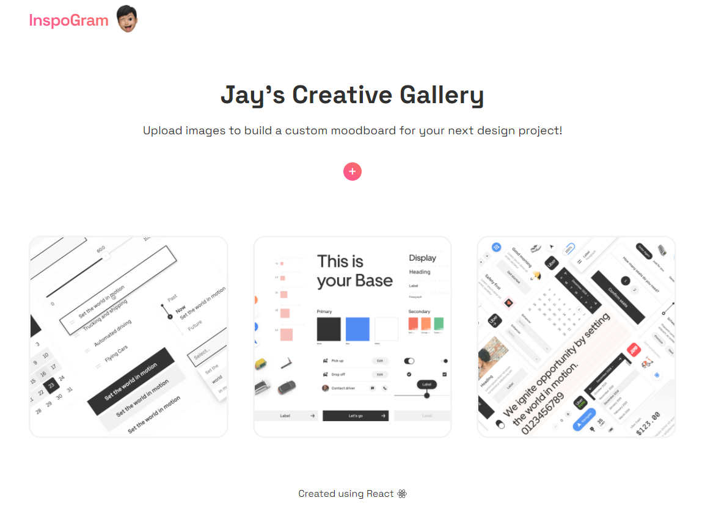

# InspoGram - A Visual Moodboard App 

Creating a moodboard is one of the first steps in any design project. As a passionate designer, I decided to create a custom moodboard app for storing creative work and ideas throughout the design process. The app itself features an upload button, progress bar, a layout-grid and image modals. 

The app was developed using **React**, **Firebase** and **Framer Motion**. Firebase was used to store file uploads and Framer Motion was used to integrate smooth animations in the UI.

Below is an image of a moodboard I created to gain inspiration for a future project. It features a gallery of Uber's Design System: Base Web. 

